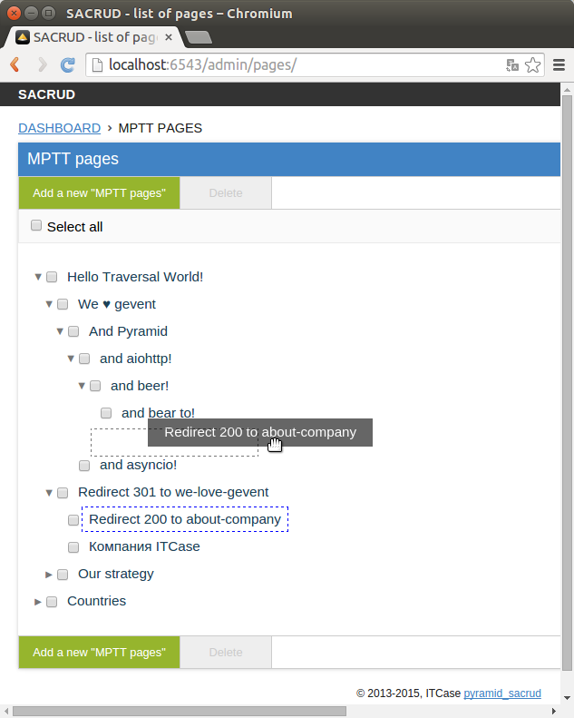

.. ps_tree documentation master file, created by
   sphinx-quickstart on Mon Jun 29 15:03:25 2015.
   You can adapt this file completely to your liking, but it should at least
   contain the root `toctree` directive.

ps_tree
=======

`ps_tree` is extension for `pyramid_sacrud
<https://github.com/ITCase/pyramid_sacrud/>`_ which displays a list of records
as tree. This works fine with models from `sqlalchemy_mptt
<https://github.com/ITCase/sqlalchemy_mptt/>`_.

.. raw:: html

    

Look how easy it is to use:

.. code-block:: python
   :caption: Create model

   from pyramid_pages.models import BaseSacrudMpttPage

   Base = declarative_base()
   DBSession = scoped_session(sessionmaker(extension=ZopeTransactionExtension()))

   class PageTree(Base, BaseSacrudMpttPage):
       __tablename__ = 'pages'

       id = Column(Integer, primary_key=True)

.. code-block:: python
   :caption: Settings for pyramid app

   config.include('ps_tree')
   config.registry.settings['ps_tree.models'] = (PageTree, )
   config.include('pyramid_sacrud', route_prefix='admin')
   config.registry.settings['pyramid_sacrud.models'] = ('', PageTree)

Usage:

.. toctree::
   :maxdepth: 2

   install.rst
   settings.rst
   api.rst

Indices and tables
==================

* :ref:`genindex`
* :ref:`modindex`
* :ref:`search`

